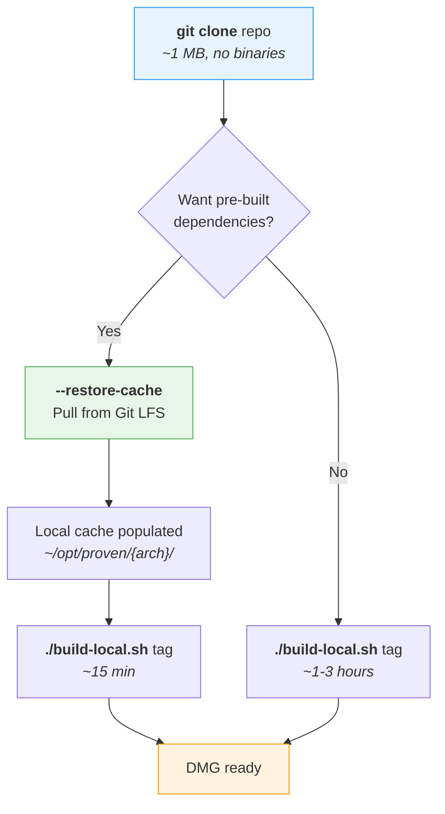
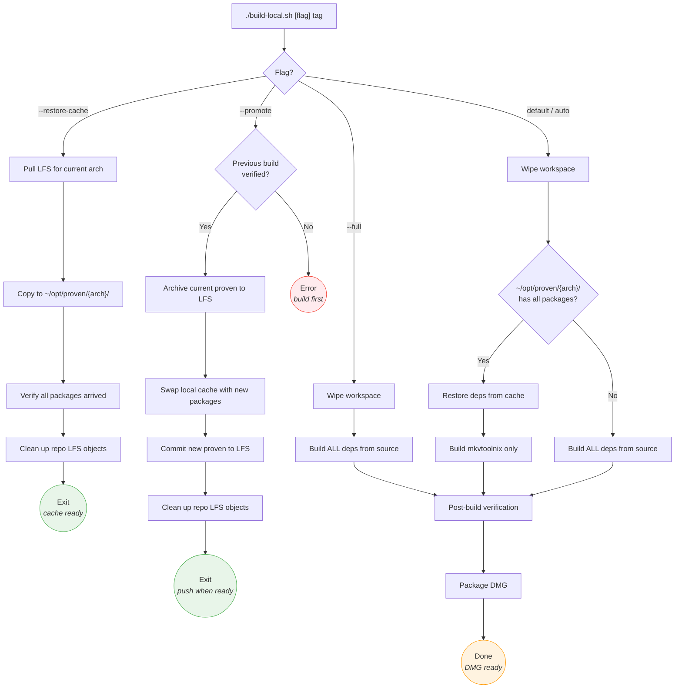
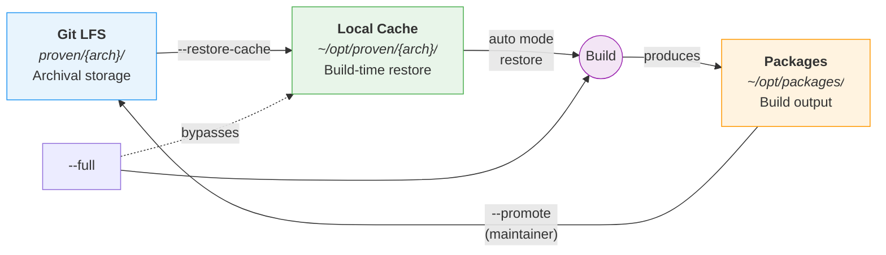

# Build Workflow

## Quick Reference

| Flag | Purpose | Who | Build time | Requires |
|------|---------|-----|-----------|----------|
| *(default)* | Auto-detect: use cache if available, otherwise full build | Anyone | 15 min (cached) / 1-3 hrs (full) | Tag |
| `--restore-cache` | Pull pre-built deps from LFS to local cache | Anyone | ~2 min | Tag |
| `--full` | Rebuild all dependencies from source | Anyone | 1-3 hours | Tag |
| `--promote` | Archive verified build to LFS | Maintainer | ~1 min | Verified build |

## First-Time Setup

Choose your path based on whether you want to use pre-built dependencies or compile everything yourself.



## Build Mode Decision Tree

What happens inside the build script depending on the flag you pass.



## Dependency Lifecycle

How dependencies flow between Git LFS, the local cache, and the build system.



> **Key insight:** `--restore-cache` and `--promote` are two ends of the same loop. Dependencies are pulled from LFS into the local cache, used during builds, and (for maintainers) promoted back to LFS after verification. The `--full` flag bypasses the cache entirely, building everything from source.

## Common Workflows

### Update documentation (no build needed)

```sh
git clone https://github.com/CorticalCode/mkvtoolnix-gui-macos.git
cd mkvtoolnix-gui-macos
# Edit docs, commit, push — no LFS objects downloaded
```

### First build on a new machine (fast path)

```sh
git clone https://github.com/CorticalCode/mkvtoolnix-gui-macos.git
cd mkvtoolnix-gui-macos
./build-local.sh --restore-cache          # ~2 min, populates local cache
./build-local.sh release-98.0             # ~15 min, uses cached deps
```

### First build on a new machine (from source)

```sh
git clone https://github.com/CorticalCode/mkvtoolnix-gui-macos.git
cd mkvtoolnix-gui-macos
./build-local.sh release-98.0             # ~1-3 hours, builds everything
```

### Subsequent builds (cache already populated)

```sh
./build-local.sh release-98.0             # ~15 min, auto-restores from cache
```

### Promote after verified build (maintainer only)

```sh
./build-local.sh --full release-98.0      # Full rebuild from source
./build-local.sh --promote release-98.0   # Archive to LFS, clean up
git push                                  # Share with others
```
