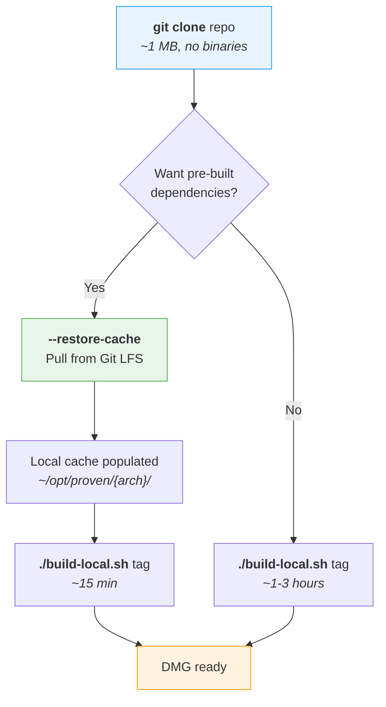
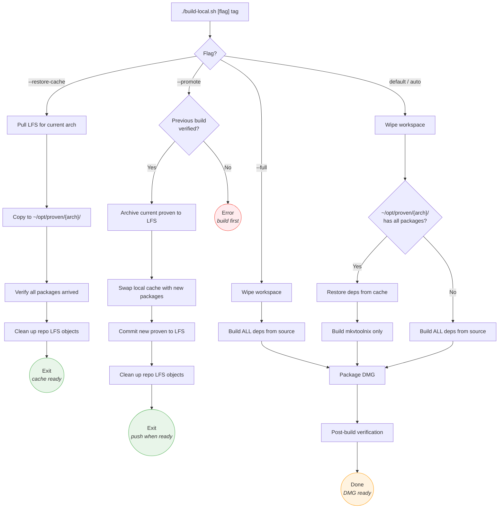
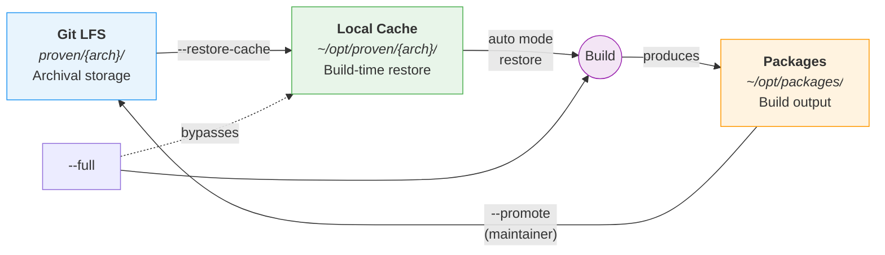
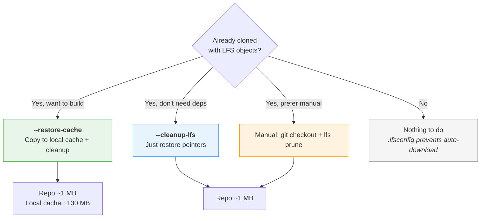

# Build Workflow

## Quick Reference

| Flag | Purpose | Who | Build time | Requires |
|------|---------|-----|-----------|----------|
| *(default)* | Auto-detect: use cache if available, otherwise full build | Anyone | 15 min (cached) / 1-3 hrs (full) | Tag |
| `--restore-cache` | Pull pre-built deps from LFS to local cache | Anyone | ~2 min | Nothing |
| `--full` | Rebuild all dependencies from source | Anyone | 1-3 hours | Tag |
| `--promote` | Archive verified build to LFS | Maintainer | ~1 min | Verified build |
| `--cleanup-lfs` | Restore proven/ to pointers, prune LFS cache | Anyone | ~10 sec | Nothing |

## First-Time Setup

Choose your path based on whether you want to use pre-built dependencies or compile everything yourself.



## Build Mode Decision Tree

What happens inside the build script depending on the flag you pass.



## Dependency Lifecycle

How dependencies flow between Git LFS, the local cache, and the build system.



> **Key insight:** `--restore-cache` and `--promote` are two ends of the same loop. Dependencies are pulled from LFS into the local cache, used during builds, and (for maintainers) promoted back to LFS after verification. The `--full` flag bypasses the cache entirely, building everything from source.

## Existing Clones (Reclaiming Disk Space)

If you cloned the repo before `.lfsconfig` was added, or cloned with `git lfs pull`, the `proven/` directory contains full binary files (~264 MB) and `.git/lfs/objects/` holds another copy (~270 MB). Here's how to reclaim that space.

### Option A: Keep deps for building, clean up repo (recommended)

Use `--restore-cache` to copy the already-downloaded binaries to your local build cache, then clean up the repo:

```sh
./build-local.sh --restore-cache
```

This copies the deps to `~/opt/proven/{arch}/`, restores `proven/` to pointer files, and prunes the LFS cache. Repo drops from ~535 MB to ~1 MB. Future builds use the local cache.

### Option B: Just reclaim space (no build planned)

If you don't need the dependencies at all:

```sh
./build-local.sh --cleanup-lfs
```

This restores `proven/` to pointer files and prunes the LFS cache. No files are copied anywhere.

### Option C: Manual cleanup (no script)

If you prefer to handle it yourself:

```sh
# Step 1: Restore proven/ files to LFS pointers
# GIT_LFS_SKIP_SMUDGE prevents checkout from re-downloading the real files
GIT_LFS_SKIP_SMUDGE=1 git checkout -- proven/

# Step 2: Verify files are now pointers (should be ~130 bytes each)
wc -c proven/arm/*.tar.gz | tail -1

# Step 3: Prune the LFS object cache (removes downloaded objects no longer
# referenced by the working copy)
git lfs prune

# Step 4: Verify space reclaimed
du -sh .git/lfs/objects/   # should be ~0 bytes
du -sh .                   # should be ~1 MB total
```

After any of these options, future `git pull` will not re-download LFS objects thanks to `.lfsconfig`.



## Build Numbers

Each build increments a per-architecture counter stored in:

- `.build-counter-arm`
- `.build-counter-intel`

These files are **tracked in git on purpose**, so the counter persists across machines. If you build on your desktop (counter reaches 13) then push, a subsequent build on your laptop continues from 14 instead of restarting at 1. Build numbers appear in internal DMG filenames (`MKVToolNix-{ver}-macos-{arch}-b013-{branch}.dmg`) and correlate binaries with entries in `build-report-{tag}.txt`, which helps when diagnosing failures across machines.

### Resetting the counter

If you cloned this repo for your own use and want to start build numbering fresh on a new machine, delete the counter files before your first build:

```sh
rm .build-counter-arm .build-counter-intel
# or just the one for your architecture
```

The counter then restarts at 1 and increments locally from there. **Do not push resets back to this repo** — doing so would collide with the maintainer's build numbering.

## Experimental Dependency Cache

For experimental builds (e.g. testing against upstream `main` with a bumped Qt version), recompiling multi-hour dependencies like Qt on every iteration is wasteful. The proven cache shouldn't absorb those builds — it's versioned to the current release — so there's a second, purely-local tier:

- `~/opt/proven-experimental/{arm,intel}/` — never pushed, never committed, machine-specific.

### How the overlay works

`build-local.sh` checks the experimental cache **first** for each expected package, falling back to the main proven cache. Packages are matched by exact filename, which includes the version:

- `qt-everywhere-src-6.11.0.tar.gz` lives in experimental (you staged it while testing upstream main)
- `qt-everywhere-src-6.10.2.tar.gz` lives in proven (the current release's Qt)

Both are safe to coexist — the build picks whichever the active `specs.sh` + `QTVER` combination is looking for.

### Staging and clearing

After a successful experimental build (packages are in `~/opt/packages/`):

```sh
./build-local.sh --stage-experimental
```

Copies all built package tarballs into `~/opt/proven-experimental/{arch}/`. Subsequent builds that need any of those versions restore them in seconds instead of recompiling.

To revert to the main proven cache only (e.g. when you're done experimenting or want a clean slate):

```sh
./build-local.sh --clear-experimental
```

Deletes `~/opt/proven-experimental/{arch}/` for the current architecture. The main proven cache is untouched.

### When to stage vs when to promote

| Use case | Action |
|----------|--------|
| You built Qt 6.11 against upstream main; iterating on patches | `--stage-experimental` — keeps Qt compiled between runs |
| The experimental work graduates to a real release | Retire local patches, merge branch, run normal `--full` build, then `--promote` |
| You want to test a totally different Qt configuration | `--clear-experimental`, then build, then `--stage-experimental` again |

`--stage-experimental` never touches git or LFS. `--promote` still behaves exactly as before and still refuses to run outside the `main` branch.

## Common Workflows

### Update documentation (no build needed)

```sh
git clone https://github.com/CorticalCode/mkvtoolnix-gui-macos.git
cd mkvtoolnix-gui-macos
# Edit docs, commit, push — no LFS objects downloaded
```

### First build on a new machine (fast path)

```sh
git clone https://github.com/CorticalCode/mkvtoolnix-gui-macos.git
cd mkvtoolnix-gui-macos
./build-local.sh --restore-cache          # ~2 min, populates local cache
./build-local.sh release-98.0             # ~15 min, uses cached deps
```

### First build on a new machine (from source)

```sh
git clone https://github.com/CorticalCode/mkvtoolnix-gui-macos.git
cd mkvtoolnix-gui-macos
./build-local.sh release-98.0             # ~1-3 hours, builds everything
```

### Subsequent builds (cache already populated)

```sh
./build-local.sh release-98.0             # ~15 min, auto-restores from cache
```

### Promote after verified build (maintainer only)

```sh
./build-local.sh --full release-98.0      # Full rebuild from source
./build-local.sh --promote release-98.0   # Archive to LFS, clean up
git push                                  # Share with others
```
