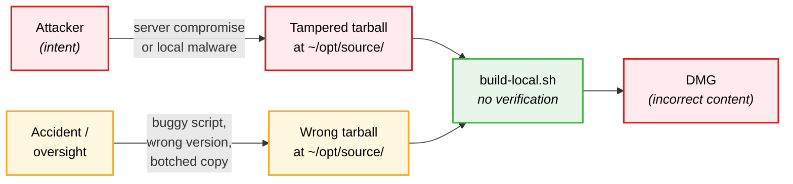
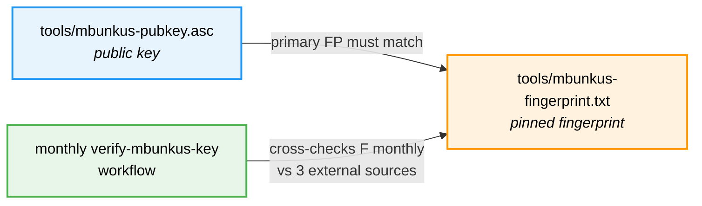
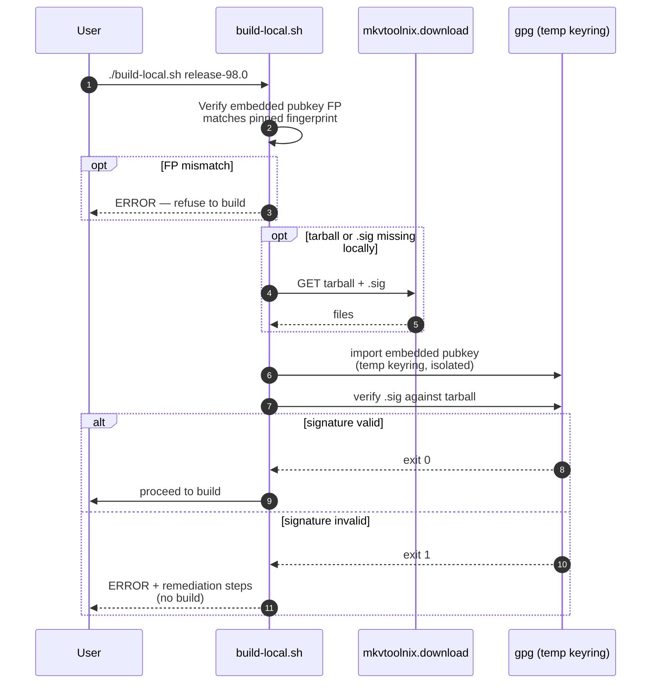
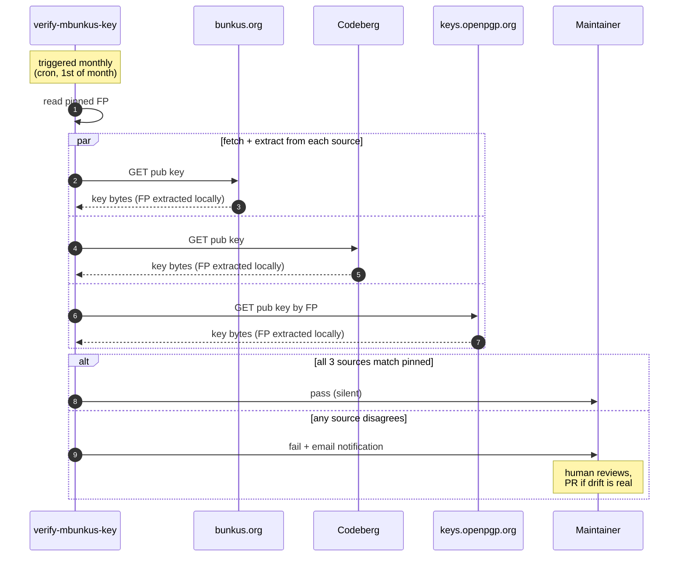
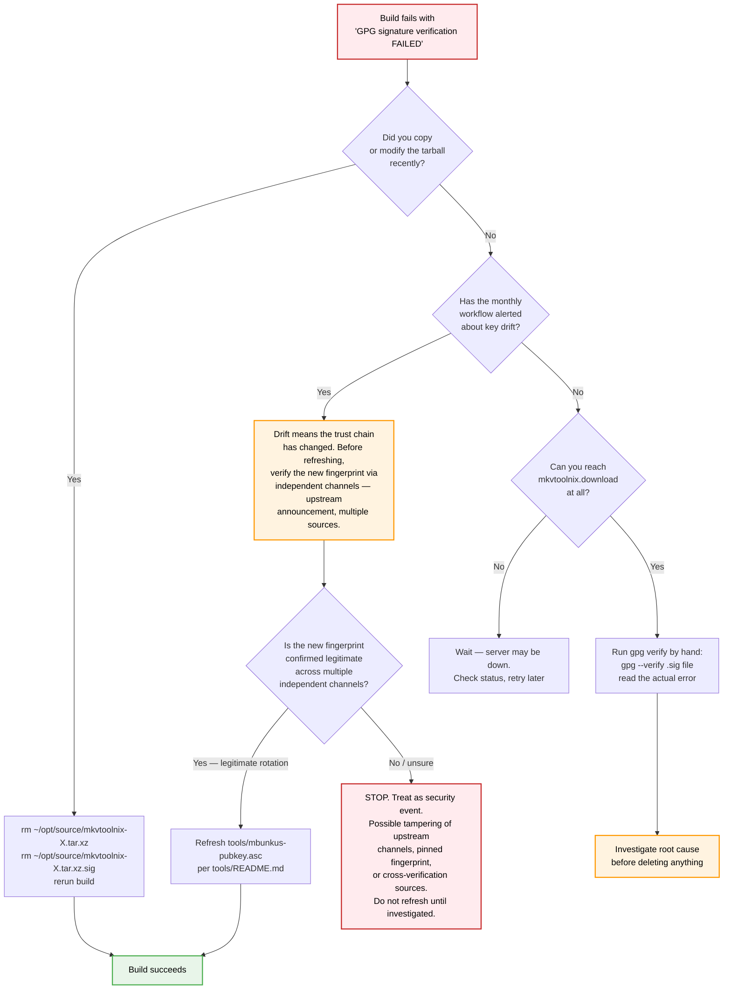
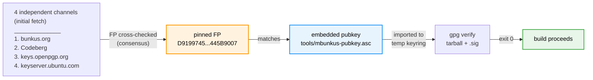

# Upstream Tarball Verification

Every build verifies the upstream `mkvtoolnix-${VERSION}.tar.xz` source tarball
against an OpenPGP signature published by the upstream maintainer
([Moritz Bunkus](https://www.bunkus.org/), `mbunkus`) before invoking the build script.
This guide explains what it does, why it exists, and how to operate it.

## Why this exists

Upstream's `packaging/macos/build.sh` does **not** checksum or verify the
mkvtoolnix tarball — `build_package /literal-path` mode bypasses
`retrieve_file`, so unlike Qt, Boost, FLAC, etc., the tarball is taken
on faith. If the file at `~/opt/source/mkvtoolnix-${VERSION}.tar.xz` is
silently replaced (server compromise, accidental local overwrite, a
buggy helper script), the next build picks it up with no detection.

That gap is exactly what enabled an internal contamination incident
in April 2026: an experimental source tree was staged into the
official tarball slot, the next "production" build silently used it,
and the resulting DMG contained patched experimental code presented
as a clean release.

## Threat model



| Threat | SHA256 from same server | OpenPGP signature |
|---|---|---|
| Network corruption / partial download | Caught | Caught |
| Local file replacement | Caught | Caught |
| `mkvtoolnix.download` server compromised | **Bypassed** — attacker also serves matching SHA | **Caught** — attacker can't forge a valid signature without the private key |
| Confirms identity of who released it | No | Yes |

OpenPGP gives more robust protection than SHA-256 alone, so we use it.

## Trust artifacts

Verification depends on a public key and a pinned fingerprint, both checked at build time. A monthly workflow watches the pinned fingerprint for drift, and a fourth file is an audit trail — how the key got into the repo in the first place.



- **`tools/mbunkus-pubkey.asc`** — the public key GPG uses at build
  time to verify the tarball signature. Fetched from
  `https://bunkus.org/gpg-pub-moritzbunkus.txt` on 2026-04-25. Public
  keys are designed for redistribution; this is exactly the use case
  mbunkus published the key for.
- **`tools/mbunkus-fingerprint.txt`** — the pinned fingerprint
  (`D9199745B0545F2E8197062B0F92290A445B9007`) acting as a tripwire
  on the public key. The build script verifies the public key's
  primary fingerprint matches this file before letting GPG use the
  key. Without this tripwire, the build would trust whatever public
  key happens to be in the repo.
- **`.github/workflows/verify-mbunkus-key.yml`** — re-checks the
  pinned fingerprint monthly against three independent sources:
  `bunkus.org`, Codeberg (`codeberg.org/mbunkus.gpg`), and
  `keys.openpgp.org`. Protects against silent drift in the pinned
  fingerprint itself. Emails the maintainer on any disagreement;
  never auto-updates.
- **`tools/README.md`** — records when the public key was fetched,
  from where, and which channels were cross-verified at that time.
  Not used at build time; it's the audit trail for how trust was
  originally established. Read this when refreshing the key (see
  "Refreshing the embedded key" below).

## How a build verifies the tarball



The temp keyring is isolated from the user's main keyring — the build
verification doesn't depend on what you have in `~/.gnupg/`, and
doesn't pollute it.

## Drift detection (monthly action)



The action **never auto-updates**. Drift signals require a human PR
that updates `tools/mbunkus-pubkey.asc` and (if the primary key
changed) `tools/mbunkus-fingerprint.txt`, with provenance noted in
the commit message.

## What to do if verification fails



The script always hard-fails and reports; it never auto-deletes the
tarball or attempts a "self-heal" re-download on failure. The
decision to delete and re-download is yours, after you've understood
why verification failed.

## Refreshing the embedded key

If the monthly workflow fails or mbunkus rotates a subkey:

1. Re-fetch from at least two independent sources, confirm primary
   fingerprint still matches `tools/mbunkus-fingerprint.txt`:
   ```sh
   curl -fsSL https://bunkus.org/gpg-pub-moritzbunkus.txt | gpg --show-keys --with-colons | awk -F: '$1=="fpr" {print $10; exit}'
   curl -fsSL https://codeberg.org/mbunkus.gpg | gpg --show-keys --with-colons | awk -F: '$1=="fpr" {print $10; exit}'
   ```
2. If primary FP unchanged: replace `tools/mbunkus-pubkey.asc` with
   the new fetch from bunkus.org.
3. Verify locally:
   ```sh
   ./build-local.sh release-XX.X  # pre-flight will exercise the new key
   ```
4. Commit with provenance note in the message.

If the **primary fingerprint itself changes**, that's a key rotation
event:
- Verify the new fingerprint via at least two out-of-band channels
  (freshly fetched bunkus.org page, signed announcement, in-person
  if possible)
- Update both `tools/mbunkus-fingerprint.txt` AND `tools/mbunkus-pubkey.asc`
- Document the rotation date and verification path in the commit
  message and in `tools/README.md`'s provenance section

## Local trust convenience

The build script's verification works regardless of what's in your
personal `~/.gnupg/`. But manual `gpg --verify` from your shell will
print a "WARNING: This key is not certified with a trusted signature"
line until you locally sign the key. To silence it:

```sh
gpg --import tools/mbunkus-pubkey.asc        # import to your keyring
gpg --lsign-key D9199745B0545F2E8197062B0F92290A445B9007
```

This adds a non-exportable local signature meaning "I personally
verified this is mbunkus." After that, `gpg --verify` shows
`[full]` instead of `[unknown]`, no warning. Owner-trust adjustment
is unnecessary for our use case (web-of-trust propagation isn't
relevant here).

## Verification chain summary



Four independent channels published the same primary fingerprint when
the key was first added (2026-04-25). The pinned FP is the consensus
value from that initial check. Three of those four channels are
re-checked monthly by the verify-mbunkus-key workflow to detect drift.
The embedded key must match the pinned FP. The tarball must verify
against the embedded key's signing subkey. Any link in the chain
breaking hard-fails the build.
